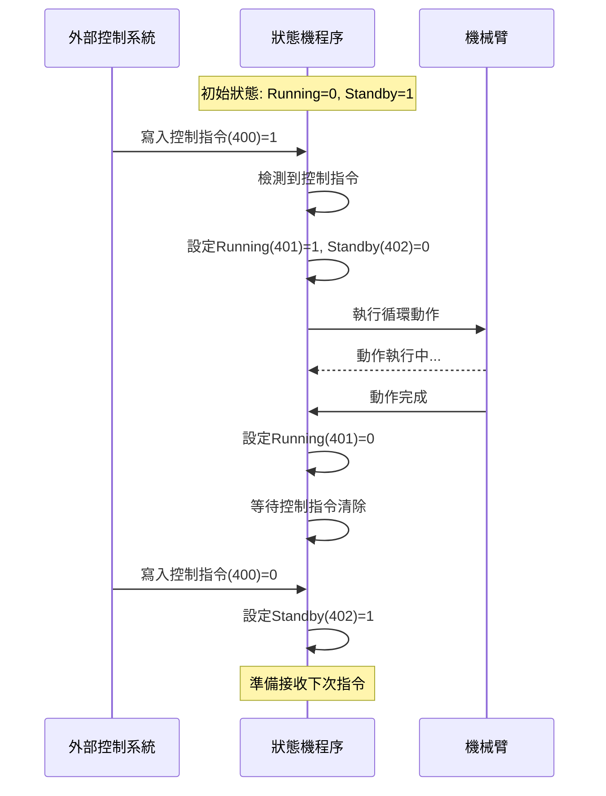

# MVP_Dobot_ModbusStateMachine 技術文檔

## 專案概述

機械臂狀態機控制系統，透過Modbus TCP通訊實現遠端控制機械臂執行預定義的循環動作。系統包含狀態機控制程序和Web監控界面。

## 系統架構

### 核心組件
- **機械臂控制**: Dobot M1 Pro (192.168.1.6)
- **通訊協議**: Modbus TCP (127.0.0.1:502)
- **控制程序**: Python狀態機實現
- **監控界面**: Flask Web應用

### 文件結構
```
M1Pro/
├── MVP.py                    # 狀態機控制程序
├── MVP_app.py               # Web控制界面
├── dobot_api.py             # 機械臂API封裝
├── templates/
│   └── index.html           # Web界面模板
└── saved_points/
    └── robot_points.json    # 機械臂點位數據
```

## Modbus地址配置

### 基地址400狀態機映射
| 地址 | 功能 | 讀寫方向 | 數值定義 |
|------|------|----------|----------|
| 400 | 控制指令 | 外部→內部 | 0=無動作, 1=開始執行 |
| 401 | 運行狀態 | 內部→外部 | 0=空閒, 1=執行中 |
| 402 | 準備狀態 | 內部→外部 | 0=未準備, 1=可接收指令 |

### 狀態機交握流程



## pymodbus API 正確用法

### 連接建立
```python
from pymodbus.client.tcp import ModbusTcpClient

# 建立連接
client = ModbusTcpClient("127.0.0.1", port=502)
if client.connect():
    print("連接成功")
```

### 讀取寄存器
```python
def read_modbus(client, address):
    """讀取Modbus寄存器 - 正確API格式"""
    try:
        # 關鍵：使用count關鍵字參數
        result = client.read_holding_registers(address, count=1)
        
        if hasattr(result, 'isError') and result.isError():
            return None
        elif hasattr(result, 'registers') and len(result.registers) > 0:
            return result.registers[0]
        else:
            return None
            
    except Exception as e:
        print(f"讀取寄存器{address}異常: {e}")
        return None
```

### 寫入寄存器
```python
def write_modbus(client, address, value):
    """寫入Modbus寄存器 - 正確API格式"""
    try:
        # 簡化API調用，不使用slave/unit參數
        result = client.write_register(address, value)
        
        if hasattr(result, 'isError') and result.isError():
            return False
        else:
            return True
            
    except Exception as e:
        print(f"寫入寄存器{address}={value}異常: {e}")
        return False
```

### 常見錯誤與解決

#### 錯誤1: unit參數問題
```
ModbusClientMixin.read_holding_registers() got an unexpected keyword argument 'unit'
```
**解決**: 移除unit/slave參數，TCP模式下不需要

#### 錯誤2: 位置參數問題  
```
ModbusClientMixin.read_holding_registers() takes 2 positional arguments but 3 were given
```
**解決**: 使用關鍵字參數 `count=1`

## 機械臂API實現

### 連接初始化
```python
from dobot_api import DobotApiDashboard, DobotApiMove

# Dashboard連接 (控制指令)
dashboard_api = DobotApiDashboard("192.168.1.6", 29999)

# Move連接 (運動指令)
move_api = DobotApiMove("192.168.1.6", 30003)

# 機械臂初始化
dashboard_api.ClearError()
dashboard_api.EnableRobot()
dashboard_api.SpeedFactor(20)  # 全域速度20%
dashboard_api.SpeedJ(20)       # 關節速度20%
dashboard_api.AccJ(20)         # 關節加速度20%
```

### 點位運動控制
```python
def move_to_point(move_api, point_data):
    """移動到指定點位"""
    joint = point_data["joint"]
    
    # 使用JointMovJ關節運動
    result = move_api.JointMovJ(
        joint["j1"], 
        joint["j2"], 
        joint["j3"], 
        joint["j4"]
    )
    
    # 等待運動完成
    move_api.Sync()
    return True
```

### 循環動作實現
```python
def execute_cycle_motion(move_api, points, cycles=10, delay=0.5):
    """執行循環運動"""
    for cycle in range(cycles):
        # 移動到第一點
        move_to_point(move_api, points["Rotate_top"])
        move_api.Sync()
        time.sleep(delay)
        
        # 移動到第二點
        move_to_point(move_api, points["Rotate_down"])
        move_api.Sync()
        time.sleep(delay)
        
        print(f"完成第{cycle+1}個循環")
```

## 狀態機控制邏輯

### 主循環實現
```python
def state_machine_loop(self):
    """狀態機主循環"""
    while self.running:
        # 1. 讀取控制指令
        control_value = self.read_modbus(CONTROL_ADDR)
        
        if control_value == 1:
            # 2. 設定執行狀態
            self.write_modbus(RUNNING_ADDR, 1)
            self.write_modbus(STANDBY_ADDR, 0)
            
            # 3. 執行機械臂動作
            success = self.execute_cycle_motion()
            
            # 4. 清除執行狀態
            self.write_modbus(RUNNING_ADDR, 0)
            
            # 5. 等待控制指令清除
            while self.read_modbus(CONTROL_ADDR) == 1:
                time.sleep(0.1)
            
            # 6. 設定準備狀態
            self.write_modbus(STANDBY_ADDR, 1)
        
        time.sleep(0.1)  # 主循環間隔
```

### 安全機制
```python
def safe_operation_check(self):
    """安全操作檢查"""
    # 檢查準備狀態
    standby_value = self.read_modbus(STANDBY_ADDR)
    running_value = self.read_modbus(RUNNING_ADDR)
    
    if running_value == 1:
        return False, "機械臂正在運行中"
    
    if standby_value != 1:
        return False, "機械臂未處於準備狀態"
    
    return True, "可以執行操作"
```

## Web監控界面

### Flask應用配置
```python
app = Flask(__name__)

# API端點
@app.route('/api/status', methods=['GET'])
def get_status():
    """獲取當前狀態"""
    return jsonify({
        'connected': modbus_ctrl.connected,
        'control': modbus_ctrl.read_register(CONTROL_ADDR),
        'running': modbus_ctrl.read_register(RUNNING_ADDR),
        'standby': modbus_ctrl.read_register(STANDBY_ADDR)
    })

@app.route('/api/trigger', methods=['POST'])
def trigger_action():
    """觸發機械臂動作"""
    success = modbus_ctrl.write_register(CONTROL_ADDR, 1)
    return jsonify({
        'success': success,
        'message': '指令發送成功' if success else '指令發送失敗'
    })
```

### 前端狀態更新
```javascript
// 自動狀態更新
setInterval(async function() {
    const status = await fetch('/api/status').then(r => r.json());
    updateStatusDisplay(status);
}, 1000);

// 觸發動作
async function triggerAction() {
    const result = await fetch('/api/trigger', {
        method: 'POST',
        headers: {'Content-Type': 'application/json'}
    }).then(r => r.json());
    
    showMessage(result.message, result.success ? 'success' : 'error');
}
```

## 使用指南

### 1. 環境準備
```bash
# 安裝依賴
pip install pymodbus flask

# 確認文件結構
M1Pro/
├── MVP.py
├── MVP_app.py
├── dobot_api.py
├── templates/index.html
└── saved_points/robot_points.json
```

### 2. 啟動順序
```bash
# 1. 確認Modbus TCP Server運行在127.0.0.1:502
# 2. 確認機械臂可連接192.168.1.6

# 3. 啟動狀態機程序
python MVP.py

# 4. 啟動Web界面 (另一個終端)
python MVP_app.py

# 5. 訪問控制界面
# http://localhost:5100
```

### 3. 操作流程
1. **Web界面**: 點擊「連接Modbus」
2. **狀態檢查**: 確認Standby=1, Running=0
3. **觸發動作**: 點擊「開始循環動作」
4. **監控執行**: 觀察Running狀態變化
5. **等待完成**: 直到Standby=1

### 4. 故障排除

#### Modbus連接問題
```python
# 檢查連接
telnet 127.0.0.1 502

# 檢查寄存器
from pymodbus.client.tcp import ModbusTcpClient
client = ModbusTcpClient("127.0.0.1", 502)
client.connect()
result = client.read_holding_registers(400, count=3)
print(result.registers)
```

#### 機械臂連接問題
```python
# 檢查網路連通性
ping 192.168.1.6

# 檢查端口
telnet 192.168.1.6 29999
telnet 192.168.1.6 30003
```

## 技術要點總結

### pymodbus正確用法
- **讀取**: `client.read_holding_registers(address, count=1)`
- **寫入**: `client.write_register(address, value)`
- **TCP模式**: 不使用unit/slave參數
- **錯誤檢查**: 使用`hasattr(result, 'isError')`

### 狀態機設計原則
- **初始狀態**: Running=0, Standby=1
- **執行序列**: Control=1 → Running=1, Standby=0 → 動作執行 → Running=0 → 等待Control=0 → Standby=1
- **安全檢查**: 執行前確認Running=0且Standby=1
- **非阻塞**: 主循環使用短間隔polling

### 機械臂控制要點
- **API分離**: Dashboard控制 + Move運動
- **同步執行**: 使用Sync()等待動作完成
- **參數設定**: 統一設定速度和加速度比例
- **錯誤處理**: 執行前ClearError()和EnableRobot()

此文檔提供完整的技術實現細節和操作指南，確保系統可靠運行。